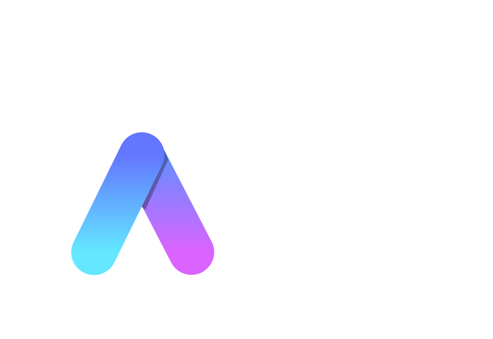

# Aqua

## What is Aqua?

</img>

    

Aqua is a fast, short, and easy programming language.

## Install

Please see [here](./docs/install.md).

## Terms of Use

This program and its source code are freely available under the MIT License.
